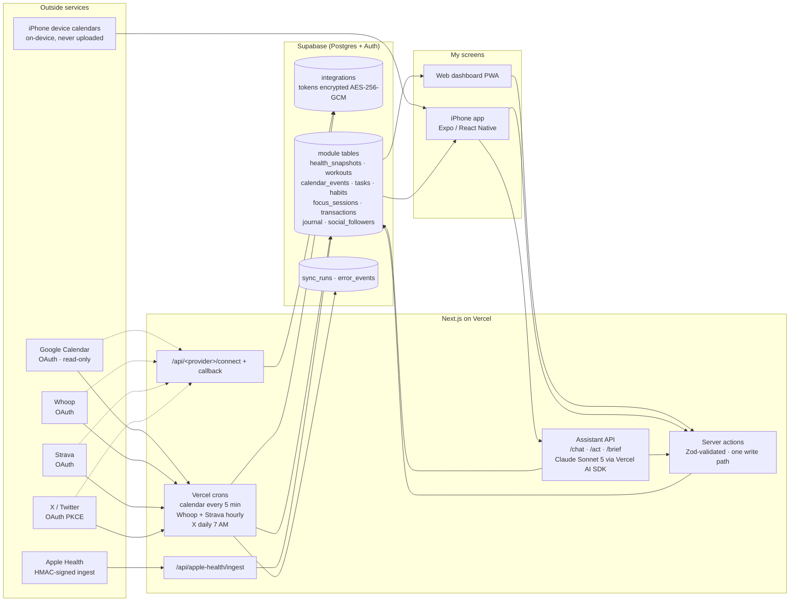

# Personal OS — Design Workup

*Written September 2026 by Max Allaire. Personal OS is a one-person product I built between May and September 2026 by directing AI coding agents. This document is the story of what it is, how it is put together, what worked, and what I would do differently. It is written for someone evaluating how I think and work, not for someone who wants to run the code — the README covers that.*

Screens referenced below live in the portfolio at `/screenshots/personal-os/`.

---

## 1. The idea: one dashboard for a life's data

I run my life across a lot of services that don't talk to each other. Whoop knows how I slept. Google Calendar knows what I'm doing at 3 PM. Strava knows how far I ran. My bank knows what I spent. Nothing knows all of it at once, so nothing can tell me the one thing I actually want to hear in the morning: *"Recovery's green and your afternoon is clear until the Sequoia call."*

Personal OS is my attempt to build that. The internal codename was **Max OS** and the framing from the first spec (21 May 2026) was blunt: it is the **source of truth** for my life, not a viewer over data that lives elsewhere. Every stream — finances, health, training, calendar, social, journal, inbox — lands in one database I own, and an assistant sits on top with the full picture.

It is deliberately a single-user product. There is no sign-up page, no pricing, no team. That decision shaped almost everything about the trust model (section 3), and it is also why I could move as fast as I did: I never had to design for a user I hadn't met.

The product shipped in three layers, in this order:

1. **A web dashboard (PWA)** — Next.js on Vercel, Supabase underneath. Twelve modules, five secondary pages, manual entry for everything, installable on the iPhone home screen. Live in production by early June 2026.
2. **Real integrations** — Google Calendar, Whoop, Strava, X, and an Apple Health ingest path, each built as a vertical slice with OAuth, backfill, a scheduled sync, and failure banners.
3. **A native iPhone app plus an assistant** — an Expo / React Native client on the same backend, with a Claude-powered assistant that can read everything and act on my behalf. This is the `feature/app-alive` work, merged to `main` on 10 July 2026.

A fourth thing grew on the side — **Stride**, a marathon-training sub-app — which I cover in section 4 because it says something about how I work, good and bad.

---

## 2. The integrations map

The rule I gave the agents on day one was **one write path**: every change to the database — a tap in the UI, a cron pulling Whoop, the assistant acting on a request — goes through the same validated, row-level-secured server code. There are no side doors. The second rule was that every table carries a **source column** (`manual`, `whoop`, `google_calendar`, `apple_health`, `strava`, `agent`…), so when two providers disagree about my sleep, a fixed priority order resolves it at write time and the UI never has to think about it.

Where each integration ended up, honestly:

| Stream | Status in September 2026 | How it gets in |
|---|---|---|
| Google Calendar | Live | OAuth once; cron every 5 minutes pulls the next 7 days |
| Whoop (recovery, sleep, strain, HRV, RHR, workouts, sleep stages) | Live | OAuth once; hourly cron |
| Strava (runs, rides) | Built and tested; waits on my own pre-flight with Strava's developer credentials | OAuth once; hourly cron |
| X (follower count) | Built; needs a paid X developer tier to run, so dormant | OAuth (PKCE); daily cron |
| Apple Health | Built as a signed ingest endpoint fed by the Health Auto Export app, then **deprecated** in favour of reading HealthKit natively in the iPhone app — which never shipped. Today Whoop covers most of what I wanted from it | HMAC-signed POST |
| iPhone device calendars | Live in the mobile app — reads whatever calendars are on the phone (iCloud, Google, anything) and merges them with the synced Google events; nothing is uploaded | On-device via `expo-calendar` |
| Money | Manual accounts, transactions and a monthly budget. The schema is Plaid-ready (`plaid_account_id`, `source` columns) but Plaid is not wired | Manual / assistant |
| Gmail | Designed, parked. The `gmail_threads` table exists; no sync | — |

Two observability tables (`sync_runs`, `error_events`) record every sync and every failure so that a broken token shows up as a banner on the dashboard instead of silently stale numbers.

---

## 3. The trust model

This app holds my calendar, my heart-rate variability, my bank balance and OAuth tokens to four services. I treated the security design as a product feature from the first plan, not a clean-up task. The pieces:

- **Single user, by design.** There is exactly one authorised operator. Sign-in is a passwordless magic link. The data model is multi-tenant-ready (every table has a `user_id` and Row-Level Security so a row is only visible to its owner) but only one account is enabled. I chose this because I could not honestly promise anyone else the security review a multi-user product deserves.
- **Tokens encrypted at rest.** Provider access and refresh tokens are encrypted with AES-256-GCM — a fresh random nonce and an authentication tag per record — before they touch the database. The key lives only as an environment secret. Tokens are decrypted in memory at the moment of use and are never returned to a client or written to a log. The Apple Health ingest secret is stored only as a SHA-256 hash and compared in constant time. All of this has unit tests: round-trip, random nonce, tampering detection, and the timing-safe compare.
- **Least privilege.** The high-privilege service-role key is used only by scheduled sync jobs, which authenticate to Vercel's cron with a shared secret and explicitly scope every read and write by user. The mobile app sends a Supabase bearer token and the API runs every query *as that user*, so RLS applies to the assistant too — the AI cannot read or write anything I couldn't.
- **Minimal scopes.** Google is read-only calendar. Whoop is read-only. The privacy policy says so in plain English.
- **A public privacy page and a written security policy.** `/privacy` (effective 8 June 2026) exists because Whoop and Google require one for OAuth consent, and I wanted it to be true rather than boilerplate — it names me, says the app has no other users, lists exactly what is read from each service, and explains how to revoke. A separate *Information Security Policy* (7 June 2026) was written for a Plaid production application; it commits to MFA on Vercel, Supabase and GitHub, to never logging financial PII, and to an incident-response step (rotate, revoke, re-authenticate).
- **Guard rails in the code, tested.** The middleware that redirects unauthenticated requests to `/login` is covered by a unit test because it only runs in production builds; an early bug where cron routes couldn't reach their own auth check taught me that lesson. Every assistant action that writes returns an **undo** handle, and destructive tools must confirm first.

The screen `privacy.png` is the real page, captured from a local build.

---

## 4. Stride — the sub-app that grew on the side

In late summer I was training for a marathon and wanted a plan that respected how I actually felt rather than a spreadsheet that assumed I was a machine. So I asked for a marathon-training workspace inside Personal OS at `/stride`. It became a surprisingly complete product of its own (verified 5 September 2026; the code is on the `wip/stride-2026-06` branch):

- A conservative **plan generator**: three to five running days, easy/tempo/long structure, strength days, recovery weeks, a taper. Weekly distance starts from a baseline *I* enter, long runs are capped at 32 km, and lower-volume profiles get easy running instead of speed work. No automatic mileage ramps.
- **Recovery check-ins** that can suggest a lighter next session after a hard effort, poor sleep or soreness — and where pain overrides fatigue. The runner reviews and applies changes; the chat cannot silently rewrite the plan.
- Run logging with perceived effort and notes, **Apple Health XML import** (with unit conversion and duplicate protection), and a **Strava** connection with encrypted, HttpOnly token cookies.
- Nutrition and hydration logging with a long-run carbohydrate calculator, and a short strength routine.
- A **coach**: a rule-based local preview that is clearly labelled as such (and hard-stops on chest-pain-style symptoms), with an optional live model behind an explicit consent switch. Sharing is off by default and a backup restore resets it to off.
- Local-first: the whole workspace lives in the browser, with full JSON backup and validated restore. The initial state is *labelled* example data that clears the moment I log a real run.

`desktop.png` and `stride-mobile.png` are Stride's overview at 1440 px and 390 px, captured against the demo workspace — no real runs.

Stride is also the part of this repo I am least at peace with, and I come back to it in section 7.

---

## 5. The mobile client (`feature/app-alive`)

On 8 June 2026 I made the call to add a native iPhone app rather than keep bending a web app around mobile limits. The trigger was Apple Health — HealthKit can only be read by a native app — but the bigger reason was that the phone is where I actually look at this thing. The decision was recorded with its cost written down: a second codebase, a new toolchain, and an Apple developer account.

The reassurance that made it affordable: **the backend is reused unchanged.** The mobile app is a new client on the same Supabase schema, the same token store, the same sync engines. What was genuinely new was the UI layer, a bearer-token auth flow, and the assistant.

The app is Expo SDK 56 / React Native 0.85 with Reanimated and SVG — about 117 TypeScript files, no charting library, no state library. Five surfaces:

- **Home** — day-progress bar, greeting, a live focus band, the recovery dial with a 7-day HRV strip, three vitals (sleep, net worth, habits) and today's ledger. `mobile.png` (light "Porcelain") and `home-dark.png` (dark "Ivy").
- **Body** — recovery, today's training, last night's sleep with stages, resting HR / HRV / weight, and the week's sessions. `body.png`.
- **Money** — net worth with a 30-day sparkline, accounts, monthly burn against budget, a transactions ledger. `money.png`.
- **Focus** — a live deep-work timer, sessions and streak, a week strip with deep hours per day, and the queue. `focus.png`.
- **Assistant sheet** — opened by the spark button on every screen. A one-line briefing synthesised across all four domains, one "top move" with Apply / Later, a short list of other things it's seeing, suggestion chips, and a free-text ask bar. `assistant.png`.

The assistant is Claude Sonnet 5 through the Vercel AI SDK. It has nineteen tools — nine reads (today's overview, health history, workouts, calendar, tasks, money, transactions, focus history, journal) and ten writes (create/complete task, toggle habit, create event, start/end focus session, log journal, add transaction, log weight, set budget). A single "today context" is assembled once per turn so the model always sees the same picture I do. Three endpoints: streaming chat, a direct `/act` route so the Apply button doesn't need a model round-trip, and a cached morning brief that also arrives as a notification.

A rule I insisted on for the mobile build: **no fake numbers.** As each surface went live its mock data was deleted; loading is a shimmer, empty is a designed empty state, and the app never shows a plausible-looking value that isn't mine. The final review before merge was specifically about "Body vitals honesty."

The visual system is a locked design handoff — a "spec-sheet" look with full-bleed hairline bands instead of cards, Manrope for words and Geist Mono for every number, one green accent per mode, and a strict rule that times and dates are always ink, never coloured. Screens render both light and dark from the system setting with zero hard-coded colours.

---

## 6. What worked

- **Spec, then plan, then build — every time.** Thirteen plan and spec documents sit in `docs/superpowers/`. Each integration was a vertical slice with an acceptance gate ("provider connected → backfill → one fresh sync lands → dashboard shows real data → revoke the token and a banner appears within 15 minutes"). Agents don't drift when the finish line is that explicit.
- **One write path and a source column.** Two boring rules that meant the assistant, the crons and the UI never fought over the same row, and adding the mobile client cost nothing on the backend.
- **Security first, tested.** Encryption, hashing, RLS and the auth middleware all landed with tests in the first weeks, not as a retrofit. When I later needed a privacy page and a security policy for provider applications, they were descriptions of what existed rather than promises.
- **Locking the design.** Once the handoff README said "this is the spec, everything else is exploration," build quality jumped. Agents compose from a small set of primitives instead of improvising.
- **The honesty rule.** Removing mock fallbacks as surfaces went live was uncomfortable (empty screens are less flattering) and exactly right.
- **Observability as product.** `sync_runs` and `error_events` turned integration failures into something I could see on the dashboard.

By the numbers, on `main` as of 10 July 2026: 204 commits, 19 database migrations, 16 API routes, four scheduled syncs, 18 unit-test files and 9 end-to-end specs on the web side, and a mobile client that passes type-check and export gates.

---

## 7. What I'd change

- **I designed the mobile visual system twice.** A blue-led "Vital" system was approved screen-by-screen on 9 June, then replaced wholesale by the green "Ivy/Porcelain" spec-sheet on 8 July. The second one is better, but a month of design work was thrown away because I explored in HTML mock-ups instead of committing to a proper design tool earlier.
- **Apple Health took three approaches and shipped none of them durably.** A third-party export app, then a deprecation in favour of native HealthKit, then the native module never got built. I should have either accepted the clunky path or not deprecated it until the replacement existed. Steps and body weight still have no automatic route.
- **Too many integrations before daily use.** X follower counts and Strava are built and dormant. The original success criterion was "open it every day for two weeks"; I cannot show evidence that gate was met, and I suspect building the next integration was more fun than using the last one.
- **Stride is idea-hopping with a good outcome.** It is a genuinely nice product — and it is local-first, uses a different model provider, has its own design language and its own Strava connection, all inside a repo whose whole point was one database and one write path. It sat uncommitted for three months. If I did it again I would either build Stride as its own repo or make it a real Personal OS module writing to `workouts`.
- **Two surfaces, two looks.** The web dashboard kept its dark, serif, `NN //` editorial style while the phone moved to Porcelain/Ivy. The backend is shared; the product identity isn't.
- **Plaid.** I wrote a security policy for it and never wired it. Money is the module I most wanted automated and it is the one still typed in by hand.
- **Plan overhead.** Thirteen planning documents for a single-user app is a lot. It bought discipline, but some slices could have been a paragraph.

The pattern under all of these: my strengths are direction, decomposition and holding a quality bar; my weakness is finishing the last, unglamorous 10% before opening the next thread. Personal OS is the clearest evidence of both.

---

## Appendix — screens in the portfolio

| File | What it is | Source |
|---|---|---|
| `mobile.png` | Home, light "Porcelain" | Locked design canvas (`design_handoff_personal_os/`, option 6b) |
| `home-dark.png` | Home, dark "Ivy" | Canvas option 6c |
| `body.png` | Body, light + dark | Canvas option 7a |
| `money.png` | Money, light + dark | Canvas option 7b |
| `focus.png` | Focus, light + dark | Canvas option 7c |
| `assistant.png` | Assistant sheet, light + dark | Canvas option 8a |
| `privacy.png` | The real `/privacy` page at 1440 px | Local build of `main` |
| `desktop.png` | Stride overview at 1440 px, demo workspace | `wip/stride-2026-06` |
| `stride-mobile.png` | Stride overview at 390 px, demo workspace | `wip/stride-2026-06` |

All values shown are the design's sample data or Stride's labelled demo workspace. Nothing in these screens is real calendar, health or financial data.
